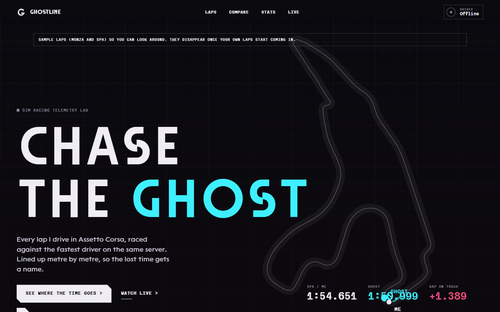
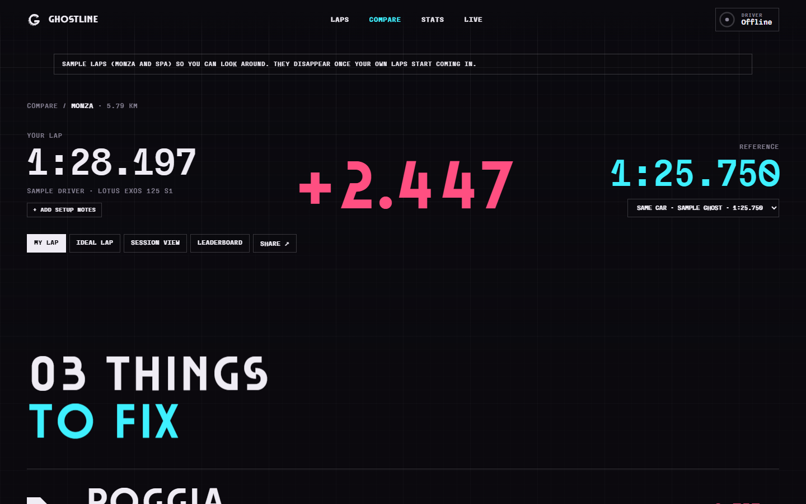
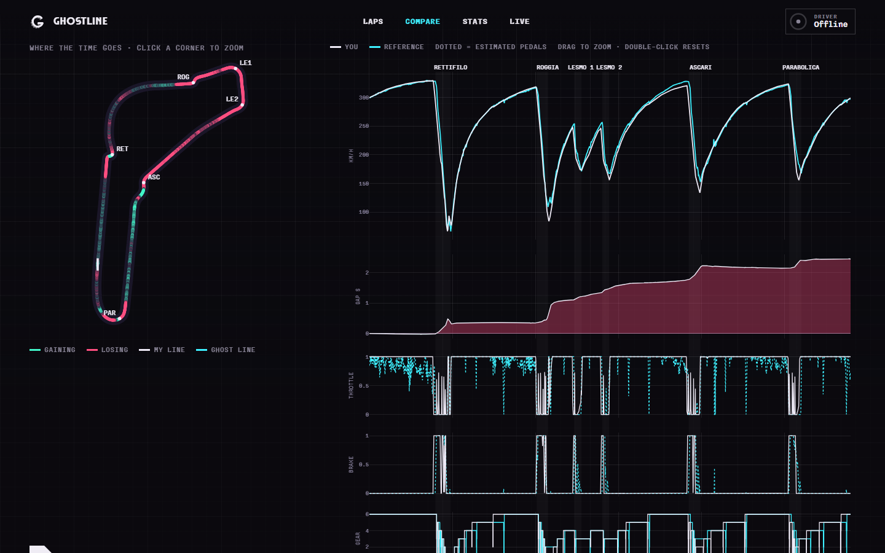
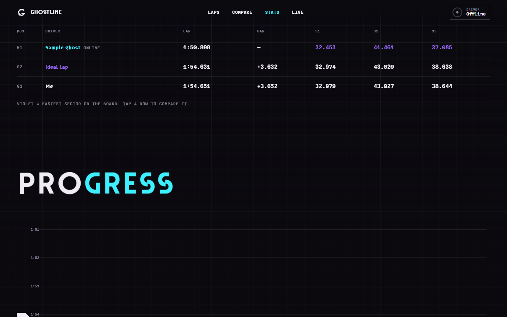

# Ghostline

   

**Find out exactly where you're losing time in Assetto Corsa.** Ghostline records your laps, quietly logs the
fastest drivers on the server you're racing on, and shows you corner by corner where they're quicker and why.

**Live demo:** [ghostline.prithvisingh.fyi](https://ghostline.prithvisingh.fyi), a read-only copy with real laps.

## What you get

- **Your laps, recorded automatically.** Speed, throttle, brake, steering, gear and your line, 60 times a second.
  No buttons, no exporting.
- **Ghosts of the fastest drivers.** A small in-game app logs every other car on the server (or the AI). The best
  lap of the three fastest drivers is kept as a ghost for each car and track. Laps that cut the track are thrown out.
- **A debrief that tells you what to fix.** "Roggia: brake 14 m later", "Lesmo 2: carry 3 km/h more through the
  apex". Plus speed, gap and pedal charts, and a track map coloured by where you gain and lose.
- **A live dash for a second monitor.** Gap to your best and to the ghost, predicted lap, sectors, how you did in
  the last corner, standings with gaps, tyres, brakes and fuel.
- **Stats.** A ghost leaderboard with sectors, your ideal lap from your best mini-sectors, and progress over time.

| Compare | Where the time goes | Stats |
|---|---|---|
|  |  |  |

Two sample comparisons (Monza and Spa, Lotus Exos 125 S1) are loaded on first start so you can look around
before you drive. They disappear once your own laps start coming in.

## Install

You need Windows 10 or 11 and Assetto Corsa from Steam. Content Manager is optional.

1. Download **[Ghostline.zip](https://github.com/pr1tzy/ghostline/releases/latest/download/Ghostline.zip)** (the latest release) and unzip it
   anywhere, for example into your Documents.
2. Double-click **`start.bat`**. The first time, it sets itself up, which takes a couple of minutes. If Python
   isn't installed, it offers to install it for you.
3. Your browser opens Ghostline. Start a session in Assetto Corsa and drive.

If Windows shows "Windows protected your PC" for the `.bat` file, click **More info > Run anyway**. The scripts
are plain text, so you can open them in Notepad to see what they do.

## Using it

- Keep `start.bat` running while you drive. Close its window to stop Ghostline.
- Don't want a console window? Use `ghostline.vbs` to start it hidden and `stop.bat` to stop it.
  `autostart.bat` starts it hidden every time you log in to Windows (`autostart.bat off` undoes that).
- The site lives at http://127.0.0.1:8765. Put the **Live** page on a second monitor while you race.
- For ghosts, race online (or against the AI) with the in-game app running. Ghostline installs it into AC for you;
  restart your AC session once after the first start.

## FAQ

**Can this get me banned? Is it a cheat?**
No. It doesn't change the game, your car or the server. Your own laps come from the same telemetry that SimHub and
Crew Chief read. Ghosts come from a normal in-game Python app that sees what your game already shows (where each
car is and how fast it's going). Some servers block custom apps; there, your laps still record but ghosts don't.

**Does it work online?**
Yes, that's the main use. Ghosts are logged from whichever server you're on, for the car you're driving.

**Does it send my data anywhere?**
No. Everything stays on your PC in the `data` folder. Nothing is uploaded, and there's no account.

**Which cars and tracks work?**
Every official Assetto Corsa car and track, including the DLCs. Mod cars and tracks are skipped, because mod
versions differ between servers, so the comparison wouldn't be fair.

**Will it hurt my FPS?**
It shouldn't. The in-game app samples 20 times a second and writes small files; the rest runs outside the game.

**Can my friends see it?**
By default only you can, on your own PC. If you want a public read-only copy, see
[docs/advanced.md](docs/advanced.md#publish-online).

**How do I update?**
Download the new version and copy your `data` folder into it (that's where your laps are), or `git pull` if you
cloned it. `start.bat` installs any new packages by itself.

**How do I uninstall it?**
Double-click `uninstall.bat`. It removes the in-game app from AC and the autostart entry. Then delete the folder.

## Something not working?

- **Live says "Waiting for AC"**: the game only shares telemetry in a session (on track or in the pits), not in
  the menus.
- **No ghosts**: open the **References** page, which shows whether the in-game app is installed and active.
  Restart your AC session after the first install. In Content Manager, check Settings > Assetto Corsa > Apps and
  tick RaceLogger.
- **"Mod content: not recorded"**: that car or track isn't official content (see the FAQ).
- **Ghostline won't start**: run `start.bat` and read the console. When it's started hidden, the log is in
  `data/ghostline.log`.

Still stuck? [Open an issue](https://github.com/pr1tzy/ghostline/issues) with the log.

## More

- [docs/advanced.md](docs/advanced.md): settings, renaming corners, publishing online, the security model, and
  working on the code.
- License: [MIT](LICENSE). Fonts and libraries: [THIRD_PARTY_NOTICES.md](THIRD_PARTY_NOTICES.md).
- Ghostline is a fan project, not affiliated with or endorsed by Kunos Simulazioni, 505 Games or Formula 1.
